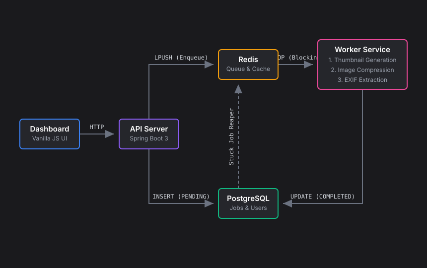

# Conveyor

<p align="center">
  <b>A highly scalable, decoupled asynchronous image processing pipeline.</b>
</p>

## Video Demo
[Watch the Project Demo on Google Drive](https://drive.google.com/file/d/1qsbcF_e8hWJU6jmDhKZaCamDhRnYzWMj/view?usp=sharing)

## About this Project
Conveyor is a distributed job processing system designed to handle heavy, CPU-bound tasks asynchronously without making the user wait. 

**End Goal & Impact:**
- **Zero UI Blocking:** Offloads intensive image manipulation (thumbnail generation, compression, EXIF extraction) from the main API thread to a fleet of background workers.
- **Flawless User Experience:** The API responds in milliseconds, while a clean vanilla JavaScript frontend dynamically polls and animates jobs from `PENDING` to `COMPLETED`.
- **Horizontal Scalability:** The background worker fleet can be scaled infinitely to process massive concurrent upload loads without dragging down the main web server.
- **Fault Tolerance:** Built-in "Stuck Job Reapers" automatically detect and requeue tasks if a worker crashes mid-process.

## Architecture

<p align="center">
  
</p>

## Tech Stack & Tools

- **Core & APIs:** Java 21, Spring Boot 3.2
- **Queue & Caching:** Redis (Lettuce Client, JSON Serialization)
- **Database & Persistence:** PostgreSQL, Spring Data JPA, Flyway Migrations
- **Image Processing Engine:** Thumbnailator, Metadata-Extractor (EXIF)
- **Security:** Stateless JWT Authentication
- **Frontend Dashboard:** Vanilla JavaScript, HTML5, Vanilla CSS (No Node.js overhead)
- **Infrastructure:** Docker, Docker Compose

## How to Use It

Conveyor is containerized and built to run flawlessly right out of the box.

**1. Clone and Setup**
```bash
git clone https://github.com/Goutham-K-278/Conveyor.git
cd Conveyor
cp .env.example .env
```

**2. Launch the Stack**
Run the following command to boot up the API server, PostgreSQL database, Redis queue, and a default Worker node:
```bash
docker compose up --build -d
```

**3. Access the Dashboard**
Open your web browser and navigate to:
```text
http://localhost:8080
```
*Register a quick account, sign in, and start drag-and-dropping images into the processing pipeline!*

**4. Scale the Workers (Optional)**
To see the true power of the distributed architecture, you can dynamically scale the background processing fleet to 3 workers:
```bash
docker compose up --scale worker=3 -d
```
